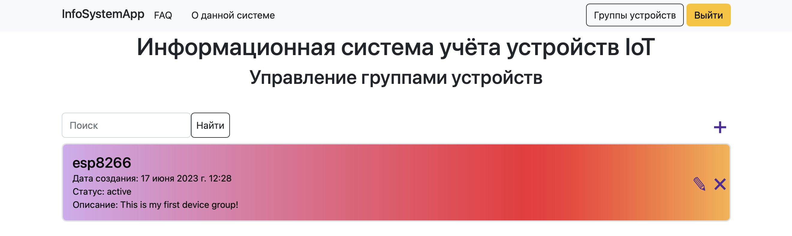

# IoT-Device-Tracker-System

## О системе

Данная информационная система предназначена для учёта устройств интернета-вещей.

Пользователь может:

* добавлять группы устройств;
* добавлять устройства в группу;
* управлять группами устройств и добавленными устройствами.

Для подключения устройства используется MQTT-брокер сообщений `Mosquito`.

Принцип взаимодействия с брокером следующий:
1. Для каждого пользователя при регистрации в системе происходит создание соответствующего MQTT-клиента.
2. При добавлении нового устройства происходит подписка клиента, соответствующего пользователю, на топик `<device_group_name>/devices/<device_id>/telemetry`.
3. Физическое устройство подключается к брокеру, используя токен аутентификации, и начинает отправку сообщений в указанный топик.

## Начало работы

Настройте виртуальное окружение и установите необходимые Python-зависимости при помощи команды 

```
pip install -r requirements.txt
```

В ддиректории `InfoSystemApp` выполните команду

```
python manage.py runserver
```

Эта команда запустит веб-сервер, после чего достаточно перейти по адресу `http://127.0.0.1:8000/`. Вы увидите домашнюю страницу приложения и сможете начать работу с сервисом.

## Домашняя страница


## Управление группами устройств



## Управление группой устройств


## Управление устройством


## Получение результатов измерений


